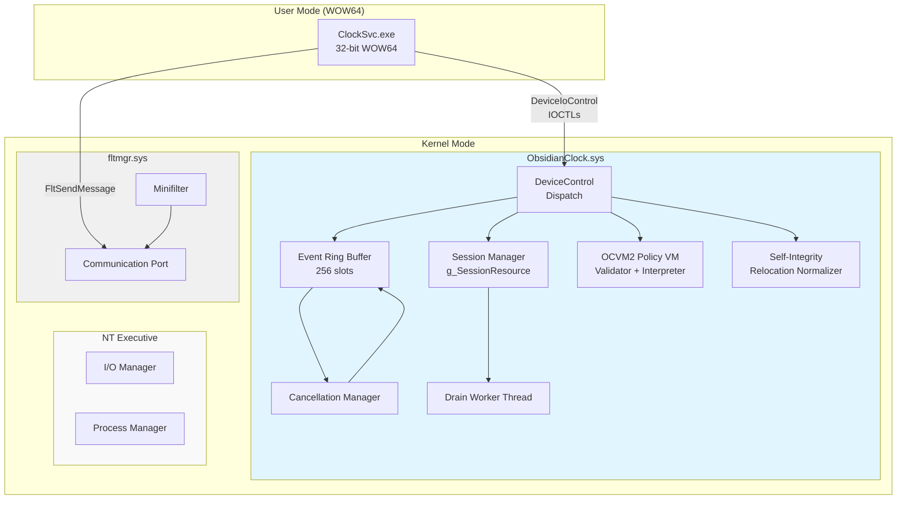
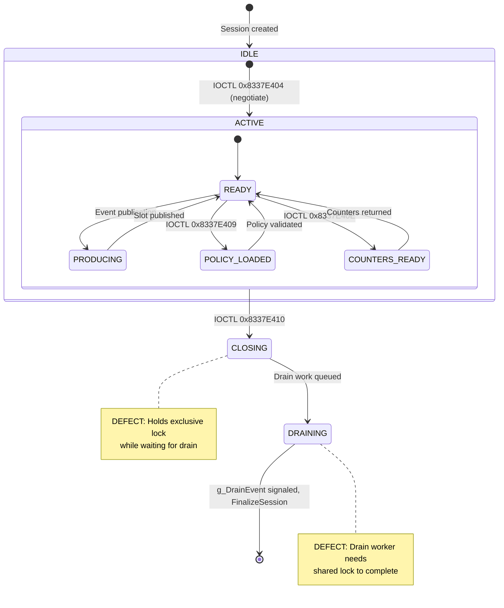
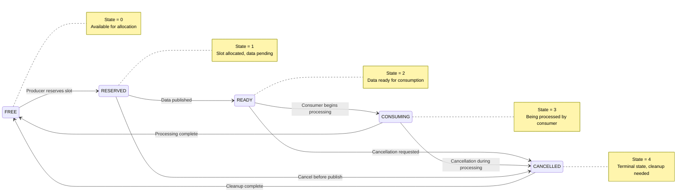

# 02_architecture.md - Obsidian Clock Architecture Reconstruction

## Driver Lifecycle

### Entry Point (DriverEntry)
**DERIVED** from [E-PE-03], [E-PE-02]

```
DriverEntry()
├── IoCreateDevice(\\Device\\ObClock) → DeviceObject
├── IoCreateSymbolicLink(\\DosDevices\\ObClock)
├── Install DeviceControl dispatch routine
├── ExInitializeResourceLite(&g_SessionResource)
├── Allocate 256-slot event ring buffer
├── KeInitializeEvent(&g_DrainEvent)
├── Register shutdown callback
├── FltRegisterFilter()
├── FltStartFiltering()
├── FltCreateCommunicationPort() → User-mode communication
└── Return STATUS_SUCCESS
```

**IRQL:** PASSIVE_LEVEL
**Locks acquired:** None initially

### Unload Path
**HYPOTHESIS** - Not directly observed in evidence capsules

```
DriverUnload()
├── Unregister shutdown callback
├── Close communication port
├── FltUnregisterFilter()
├── Delete symbolic link
├── Delete device object
├── Free ring buffer
├── ExDeleteResourceLite(&g_SessionResource)
└── Return
```

**Confidence:** Medium (inferred from standard driver patterns)

---

## Component Architecture Diagram



---

## Session State Machine

**DERIVED** from [E-LOCK-03], [E-IO-02], [E-RING-01]



### Session States

| State | Description | Transitions |
|-------|-------------|-------------|
| IDLE | No active session | → ACTIVE on successful negotiation |
| ACTIVE | Session established | Multiple substates for operations |
| CLOSING | Close requested, waiting for drain | → DRAINING after work queued |
| DRAINING | Outstanding records being completed | → TERMINAL when count reaches 0 |
| TERMINAL | Session finalized, resources freed | → [*] |

---

## Ring Slot State Machine

**FACT** from [E-RING-01]



### State Transition Invariants

**DEFECT** per [E-RING-06]: Transition CANCELLED→FREE or CONSUMING→FREE does not verify cancellation contexts are detached.

---

## Lock/Wait Graph

**FACT** from [E-LOCK-01], [E-LOCK-02], [E-LOCK-03]

```mermaid
flowchart TD
    subgraph Threads
        T41["Thread T41<br/>(Close IOCTL)"]
        T73["Thread T73<br/>(Drain Worker)"]
    end
    
    subgraph Resources
        SessionRes["g_SessionResource<br/>(ERESOURCE)"]
        DrainEvent["g_DrainEvent<br/>(KEVENT)"]
    end
    
    T41 -->|Holds EXCLUSIVE| SessionRes
    T41 -->|Waiting on| DrainEvent
    
    T73 -->|Waiting to acquire SHARED| SessionRes
    T73 -->|Can signal| DrainEvent
    
    style T41 fill:#ffcccc
    style T73 fill:#ffcccc
    style SessionRes fill:#ffffcc
    style DrainEvent fill:#ccffcc
    
    note right of T41
        Owns exclusive lock,<br/>waits for event
    end note
    
    note right of T73
        Needs shared lock to<br/>decrement counter and<br/>signal event
    end note
```

### Deadlock Cycle Proof

**DERIVED** from wait-for graph:

1. T41 holds `g_SessionResource` exclusively
2. T41 waits for `g_DrainEvent` to be signaled
3. Only T73 can signal `g_DrainEvent` (when OutstandingRecords → 0)
4. T73 waits to acquire `g_SessionResource` shared
5. ERESOURCE semantics: shared acquisition blocked while exclusive held
6. **Cycle:** T41 → waits for event ← T73 → waits for lock → T41

**Conclusion:** Classic lock-holder-waiting-for-lock-dependent-operation deadlock.

---

## Function Registry

### Recovered Functions

| Name | RVA | IRQL | Inputs | Outputs | Locks | Evidence |
|------|-----|------|--------|---------|-------|----------|
| `OcCreateSession` | 0x67D0 | PASSIVE | PID, Nonce, Caps, CRC | SessionHandle | None | [E-IO-01], [E-IO-05] |
| `OcSubmitPolicy` | 0x6AE0 | PASSIVE | PolicyBuffer, Length | Status | SessionResource (shared?) | [E-IO-01], [E-IO-02] |
| `OcGetCounters` | 0x71B0 | PASSIVE | OutputBuffer | Counters | None | [E-IO-01], [E-IO-02] |
| `OcCloseSession` | 0x7770 | PASSIVE | SessionHandle | Status | SessionResource (exclusive) | [E-IO-01], [E-LOCK-03] |
| `OcCancelWorkItem` | Unknown | PASSIVE | Ticket | None | CancelSpinLock | [E-RING-05] |
| `OcCompleteCancelledRequest` | Unknown | ≤DISPATCH_LEVEL | IRP | None | None | [E-RING-05] |
| `OcCompleteReadySlot` | Unknown | ≤DISPATCH_LEVEL | IRP | None | None | [E-RING-05] |
| `OcDrainDpc` | Unknown | DISPATCH_LEVEL | DPC | None | None | [E-RING-05] |
| `OcDrainWorker` | Unknown | PASSIVE | Session | None | SessionResource (shared) | [E-LOCK-02] |
| `OcDrainFinalRecord` | Unknown | PASSIVE | Session | None | SessionResource (shared) | [E-LOCK-02] |
| `OcValidatePolicy` | Unknown | PASSIVE | PolicyBuffer | Status | None | [E-VM-02] |
| `OcInterpretPolicy` | Unknown | PASSIVE | PolicyBuffer | Status/Fault | None | [E-VM-03] |
| `OcNormalizeAndHash` | Unknown | PASSIVE | ImageBase, Delta | Hash | None | [E-INT-03] |

### Trust Boundaries

| Boundary | Components Separated | Validation Required |
|----------|---------------------|---------------------|
| User/Kernel | ClockSvc ↔ ObsidianClock | IOCTL buffer validation, size checks |
| WOW64/Native | 32-bit client ↔ 64-bit driver | Explicit wire format, no struct casting |
| Driver/Filter | ObsidianClock ↔ FLTMGR | Filter message validation |
| Kernel/User Port | CommPort ↔ ClockSvc | Port message validation |

---

## Architecture Confidence Assessment

| Component | Confidence | Notes |
|-----------|------------|-------|
| Device creation | High | Direct evidence [E-PE-03] |
| Symbolic link | High | Direct evidence [E-PE-03] |
| Minifilter registration | High | Direct evidence [E-PE-03], imports [E-PE-02] |
| Communication port | High | Direct evidence [E-PE-03] |
| ERESOURCE initialization | High | Import ExInitializeResourceLite [E-PE-02] |
| Ring buffer allocation | High | Direct evidence [E-PE-03], [E-RING-01] |
| Shutdown callback | Medium | Mentioned in [E-PE-03], details unknown |
| Session state machine | Medium | Derived from close behavior [E-LOCK-03] |
| Cancel routine registration | Medium | Imports present [E-PE-02], usage in traces [E-RING-05] |
| VM validator/interpreter split | High | Direct decompilation [E-VM-02], [E-VM-03] |
| Integrity normalizer | High | Direct decompilation [E-INT-03] |

---
*End of Architecture Reconstruction*
