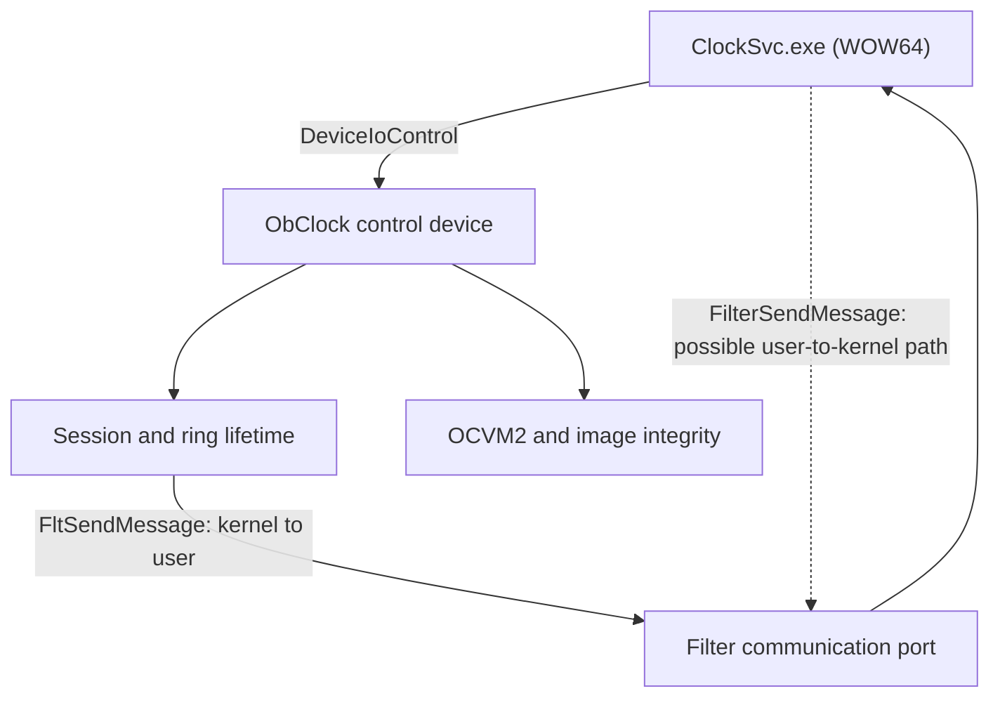
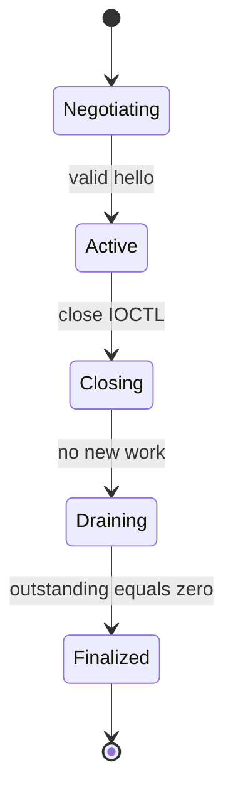
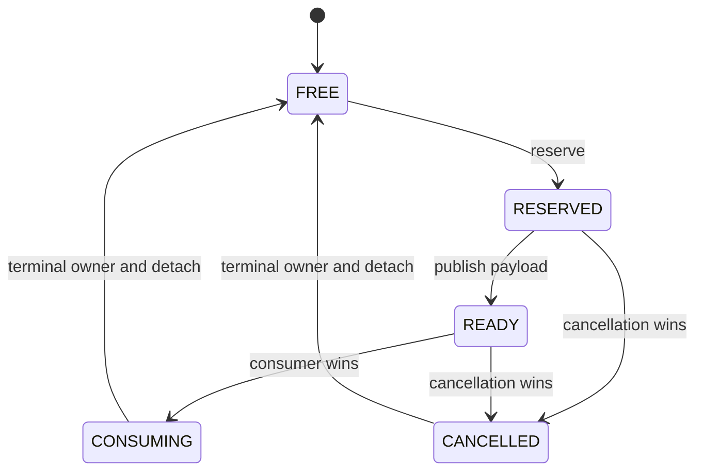
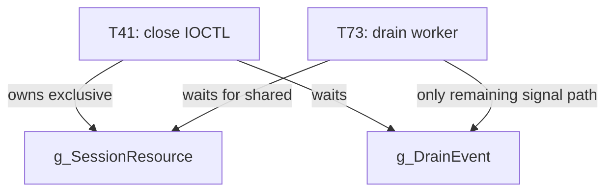

# Architecture reconstruction

## Scope

This reconstruction uses only the evidence capsules.  There is no binary from
which to recover a complete call graph, callback table, unload routine, precise
IRQL contract, or private type information.  Names beginning with `Oc` are
analyst labels derived from behaviour or stack summaries, not recovered symbols
unless a capsule explicitly supplies them.

## Observed components

**FACT — `[E-PE-03]`:** the reachable initialization path creates
`\Device\ObClock`, publishes `\DosDevices\ObClock`, installs a device-control
dispatch routine, registers and starts a minifilter, creates a user-mode
communication port, initializes an `ERESOURCE`, allocates a 256-slot shared
event ring, and registers a shutdown callback.

**FACT — `[E-PE-02]`:** imports include the I/O, executive-resource, event,
Filter Manager, allocation, image, and CFG functions listed in the evidence
ledger.  An import establishes availability, not a call site by itself.

`FltSendMessage` is a kernel minifilter API for sending to a connected
user-mode client.  A user-mode client would use Filter Manager APIs such as
`FilterGetMessage`, `FilterReplyMessage`, or `FilterSendMessage`; the capsules
do not establish which of these `ClockSvc.exe` calls.  The dashed edge is
therefore an **INFERENCE**, not a recovered call.

## Initialization and teardown

The following responsibilities are facts, but their exact order and cleanup
unwind logic are unknown:

| Responsibility | Basis | Confidence |
|---|---|---:|
| Control device and symbolic link | `[E-PE-03]` | High |
| Device-control dispatch | `[E-PE-03]` | High |
| Filter registration, start, communication port | `[E-PE-03]` | High |
| Session resource and drain event | `[E-PE-02]`, `[E-LOCK-*]` | High |
| 256-slot ring | `[E-PE-03]`, `[E-RING-01]` | High |
| Shutdown callback | `[E-PE-03]` | High |
| Unload callback and cleanup order | not supplied | Unknown |
| Partial-initialization unwind | not supplied | Unknown |

It would be reasonable for a real driver to undo these registrations during
unload, but writing a conventional unload sequence here would be a design
proposal rather than recovered behaviour.

## Control-plane dispatch

`[E-IO-01]` supplies four jump-table targets.  `[E-IO-02]` supplies their
semantics.  The table does not prove full function prototypes or every status
path.

| Target RVA | IOCTL | Analyst label | Evidence-backed purpose |
|---:|---:|---|---|
| `0x67D0` | `0x8337E404` | `OcNegotiateSession` | Establish/negotiate session |
| `0x6AE0` | `0x8337E409` | `OcSubmitPolicy` | Submit policy buffer |
| `0x71B0` | `0x8337E40E` | `OcQueryHealth` | Return counters/health information |
| `0x7770` | `0x8337E410` | `OcCloseSession` | Close and request drain |

The exact decoded bit fields are in [`03_ioctl_abi.md`](03_ioctl_abi.md).

## Session lifecycle

The state names below are an **INFERENCE** that explains `[E-IO-02]` and
`[E-LOCK-03]`; only the close behaviour is shown as pseudocode in the evidence.

Required lifetime properties are:

- only an active session accepts new work;
- transition to closing is atomic;
- outstanding work holds explicit ownership until completion;
- finalization happens once and only after rundown;
- no blocking wait occurs while holding the resource needed by drain work.

The supplied implementation violates the last property; see
[`05_deadlock.md`](05_deadlock.md).

## Ring-slot lifecycle

The numeric states are facts from `[E-RING-01]`.  Individual legal edges beyond
the supplied reserve/publish/cancel/consume behaviour are partly inferred.

The critical missing guard is not a state name: `[E-RING-06]` says a slot can
return to `FREE` without proof that all cancellation contexts for the previous
occupant have detached.  The 16-bit generation and reusable owner ID can then
form the same truncated identity for a different occupant.  See
[`04_ring_lifetime.md`](04_ring_lifetime.md).

## Wait graph

This is a closed wait cycle because T41 cannot release the resource while its
wait is pending, and T73 cannot signal the event without acquiring that
resource.  The service thread is blocked in the close IOCTL and supplies no
independent breaker `[E-LOCK-04]`.

## Other recovered paths

| Path | Evidence | What is established | What remains unknown |
|---|---|---|---|
| Cancellation worker and two completion stacks | `[E-RING-05]` | Both paths reach `IofCompleteRequest` for one logical failure | Complete IRP ownership implementation |
| Policy validator/interpreter | `[E-VM-02]`, `[E-VM-03]` | Different branch-unit calculations | Full opcode set and policy header |
| Image normalizer/hash | `[E-INT-01]`–`[E-INT-04]` | Relocation normalization precedes hashing and mishandles type 0 | Exact section set and digest algorithm |
| CFG dispatch | `[E-PE-01]`, `[E-PE-04]` | GuardCF is enabled | No evidence of custom obfuscation |

## Trust boundaries

| Boundary | Required validation |
|---|---|
| User buffer to kernel control plane | IOCTL access/method, actual input length, version, field bounds |
| WOW64 wire packet to native driver | Explicit byte serialization; no native struct casting |
| Policy bytes to OCVM2 | Complete structural and control-flow validation before execution |
| Ring ticket to current occupant | Full occupant identity plus attached-lifetime proof |
| Mapped PE bytes to integrity digest | Strict relocation parsing, mapped-range bounds, explicit type dispatch |

These boundaries describe defensive requirements; they are not evidence of a
real deployed security product.
