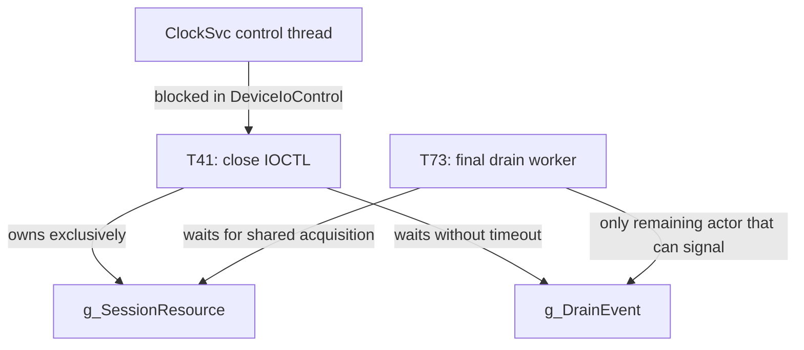

# Close/drain deadlock

## Wait-for graph

**FACT — `[E-LOCK-01]`–`[E-LOCK-04]`:**



## Cycle proof

1. T41 owns `g_SessionResource` exclusively.
2. T41 cannot proceed until `g_DrainEvent` is signalled.
3. Outstanding records equal one, and T73 is the only remaining path that can
   decrement the value and signal the event.
4. T73 cannot proceed until it acquires the same resource shared.
5. Shared acquisition cannot succeed while T41 retains exclusive ownership.
6. T41 releases the resource only after its infinite wait returns.

Therefore each required progress edge depends on the other.  The user-mode
thread is already blocked and no capsule supplies a watchdog or third breaker.

## Why a timeout is not the repair

A timeout would eventually break this particular wait, reducing outage time.
It would not define who owns outstanding work, whether finalization can race a
late worker, or whether a repeated close can free live state.  It is useful as
fault containment and telemetry, not as the lifetime invariant.

## Corrected close protocol

The correction separates state mutation under the resource from blocking
rundown outside it:

```c
AcquireExclusive(SessionResource);

if (session->State == FINALIZED) {
    Release(SessionResource);
    return already_closed;
}

if (session->State == ACTIVE) {
    session->State = CLOSING;
    RejectNewOperations(session);
    BeginRundown(session);          // existing work keeps references
    QueueDrainIfNeeded(session);
}

TakeCloseReference(session);
Release(SessionResource);          // no blocking wait under ERESOURCE

wait_result = WaitForRundownWithBoundedTimeout(session);

AcquireExclusive(SessionResource);
if (wait_result == completed &&
    session->Outstanding == 0 &&
    session->State == CLOSING) {
    session->State = FINALIZED;     // one finalizer wins
    DetachSessionFromLookup(session);
}
Release(SessionResource);

ReleaseCloseReference(session);
return TranslateCloseResult(wait_result);
```

The exact Windows primitives cannot be selected without source and IRQL
contracts.  The semantic requirements are:

- transition `ACTIVE -> CLOSING` once;
- reject new acquisitions after rundown begins;
- let each admitted worker retain a reference until it decrements outstanding;
- signal rundown without needing a resource held by the waiter;
- wait outside `g_SessionResource`;
- permit only one `CLOSING -> FINALIZED` transition;
- detach lookup visibility before the last reference is released;
- log a bounded timeout without freeing live work.

## Lock order

| Order | Object | Rule |
|---:|---|---|
| 1 | Session lookup/global registry | Never wait while held |
| 2 | `g_SessionResource` | Protect state transitions; release before rundown wait |
| 3 | Per-session queue/ring synchronization | Never acquire session resource while holding a terminal/cancel lock unless globally documented |
| 4 | Event/rundown wait | No driver-owned resource may remain held |

## Regression matrix

| Scenario | Required result |
|---|---|
| Close with zero work | Immediate single finalization |
| Close with one drain worker | Worker acquires required resource and signals rundown |
| Close while producing | New work rejected after `CLOSING`; admitted work drains |
| Close while cancelling | One terminal owner; close waits on retained reference |
| Two concurrent close calls | One state transition/finalizer; deterministic result for loser |
| Service process exits | Kernel references drain or timeout without use-after-free |
| Shutdown callback races close | Same rundown object and finalization gate are used |
| Drain timeout | Diagnostic result; session remains owned until safe cleanup |

## Residual unknowns

The capsules do not define whether the real code uses rundown protection,
remove locks, reference counts, or a custom counter.  They also do not establish
all locks acquired by the filter communication path.  The protocol above is a
source-level design, not a binary patch.
